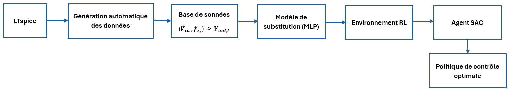

# Stage_IA_Pour_Les_Convertisseurs_De_Puissance_YACOUBI_Fatima_Zahra
## **Présentation**
Ce dépôt contient les travaux réalisés dans le cadre de mon stage de fin d’études portant sur le développement d’une stratégie de contrôle basée sur l’intelligence artificielle pour un convertisseur DC-DC résonant LLC destiné à une application aéronautique.

L'objectif est de développer un contrôleur capable d'adapter automatiquement la fréquence de commutation afin de maintenir une tension de sortie de 28 V malgré les variations de la tension d'entrée.

La méthode proposée combine :
* la simulation électrique du convertisseur sous LTspice ;
* l'automatisation des simulations avec Python ;
* le développement d'un modèle de substitution basé sur un réseau de neurones multicouche (MLP) ;
* l'apprentissage par renforcement avec l'algorithme Soft Actor-Critic (SAC).

## **Workflow du projet**

  

